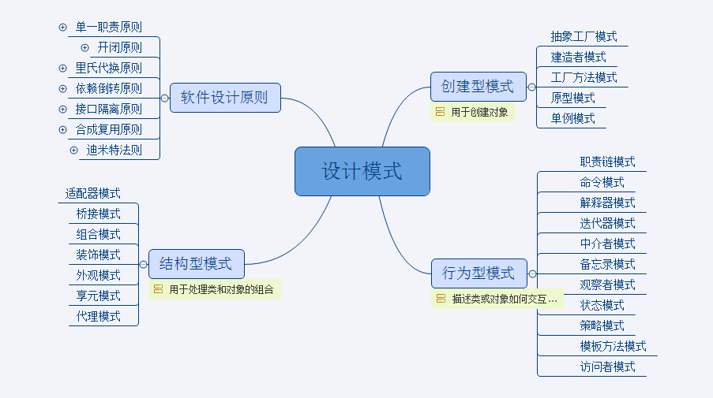

# Design-Patterns
### My practice of design patterns in java.

1. **Factory Pattern**
  * Factory pattern is one of most used design pattern in Java. This type of design pattern comes under creational pattern as this pattern provides one of the best ways to create an object.
  * In Factory pattern, we create object without exposing the creation logic to the client and refer to newly created object using a common interface.
  
2. **Abstract Factory Pattern**
  * Abstract Factory patterns work around a super-factory which creates other factories. This factory is also called as factory of factories. This type of design pattern comes under creational pattern as this pattern provides one of the best ways to create an object.
  * In Abstract Factory pattern an interface is responsible for creating a factory of related objects without explicitly specifying their classes. Each generated factory can give the objects as per the Factory pattern.
  
3. **Singleton Pattern**
  * Singleton pattern is one of the simplest design patterns in Java. This type of design pattern comes under creational pattern as this pattern provides one of the best ways to create an object.
  * This pattern involves a single class which is responsible to create an object while making sure that only single object gets created. This class provides a way to access its only object which can be accessed directly without need to instantiate the object of the class.

4. **Builder Pattern**
  * Builder pattern builds a complex object using simple objects and using a step by step approach. This type of design pattern comes under creational pattern as this pattern provides one of the best ways to create an object.
  * A Builder class builds the final object step by step. This builder is independent of other objects.

5. **Prototype Pattern**
  * Prototype pattern refers to creating duplicate object while keeping performance in mind. This type of design pattern comes under creational pattern as this pattern provides one of the best ways to create an object.
  * This pattern involves implementing a prototype interface which tells to create a clone of the current object. This pattern is used when creation of object directly is costly. For example, an object is to be created after a costly database operation. We can cache the object, returns its clone on next request and update the database as and when needed thus reducing database calls.

6. **Adapter Pattern**
  * Adapter pattern works as a bridge between two incompatible interfaces. This type of design pattern comes under structural pattern as this pattern combines the capability of two independent interfaces.
  * This pattern involves a single class which is responsible to join functionalities of independent or incompatible interfaces. A real life example could be a case of card reader which acts as an adapter between memory card and a laptop. You plugin the memory card into card reader and card reader into the laptop so that memory card can be read via laptop.

7. **Bridge Pattern**
  * Bridge is used when we need to decouple an abstraction from its implementation so that the two can vary independently. This type of design pattern comes under structural pattern as this pattern decouples implementation class and abstract class by providing a bridge structure between them.
  * This pattern involves an interface which acts as a bridge which makes the functionality of concrete classes independent from interface implementer classes. Both types of classes can be altered structurally without affecting each other.

8. **Filter Pattern**
  * Filter pattern or Criteria pattern is a design pattern that enables developers to filter a set of objects using different criteria and chaining them in a decoupled way through logical operations. This type of design pattern comes under structural pattern as this pattern combines multiple criteria to obtain single criteria.
